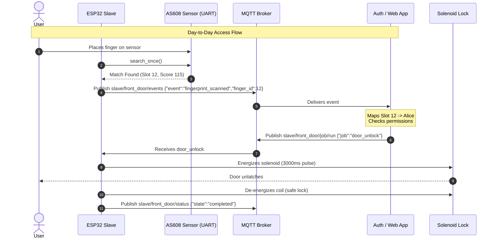

# MicroPython MQTT Slave (AS608 Fingerprint & Solenoid Door Controller)

A robust MicroPython edge firmware for ESP32 devices that executes physical jobs over MQTT:
- **AS608 Optical Fingerprint Reader**: UART communication for onboard image capture, 1-to-N template search, guided enrollment, and deletion. Emits scan events (`finger_id`, confidence) over MQTT to be mapped to users and authorization by an external app or Home Assistant.
- **Solenoid Door Locks**: Reliably pulsed GPIO control with hardware safety watchdogs so coils never overheat.
- **Home Assistant Integration**: Hybrid MQTT Auto-Discovery for status, health, abort controls, and routine triggers.

---

## 1. System Architecture & Flow



---

## 2. Interactive Multi-Scan Enrollment Architecture

For high reliability, optical fingerprint sensors require multiple samples per finger (e.g. 5 scans at slight angle variations) across 2 fingers (left and right):

- **Smartphone Web App (Orchestrator)**:
  - User visits a locally hosted web page on their smartphone and enters their name ("Alice").
  - Web App allocates template slots in the AS608 (e.g., slots 10–14 for left index, 15–19 for right index).
  - Web App displays guided visual instructions:
    * *"Sample 1 of 5: Place left index finger flat on sensor..."*
    * *"Lift finger..."*
    * *"Sample 2 of 5: Place finger again tilted slightly to the right..."*
  - For each sample, the web app triggers an atomic `enroll_step` on the ESP32.
- **ESP32 Edge Slave (Physical Executor)**:
  - Executes `enroll_step(slot_id)`.
  - Gives audio/visual feedback (buzzer chirp on touch, status LED).
  - Enforces **finger-lift detection** between scans to ensure the user physically lifts and re-places their finger.
  - Streams real-time state events back to MQTT (`waiting_for_finger`, `captured`, `waiting_for_lift`, `stored`).

---

## 3. Hardware & Wiring

All signals between the ESP32 and AS608 operate at **3.3V logic**.

| Peripheral | Signal | ESP32 Pin | Notes |
|------------|--------|-----------|-------|
| **AS608** | VCC | 3.3V / 5V | Check module voltage specs (many accept 3.3V - 5V) |
| **AS608** | GND | GND | Common ground |
| **AS608** | TXD | GPIO 16 (RX2) | Connect sensor TX to ESP32 RX |
| **AS608** | RXD | GPIO 17 (TX2) | Connect sensor RX to ESP32 TX |
| **AS608** | WAK | GPIO 18 (In) | Optional touch interrupt / wake pin |
| **Solenoid Gate** | Control | GPIO 23 (Out) | Connect to MOSFET gate or relay input |
| **Buzzer** | Signal | GPIO 19 (Out) | Active piezo buzzer |
| **Status LED** | Signal | GPIO 2 (Out) | Onboard / external indicator LED |

> [!CAUTION]
> **Flyback Diode Requirement**: When driving an inductive 12V solenoid lock, you MUST place a flyback diode (e.g., 1N4007) across the solenoid terminals (cathode to +12V, anode to MOSFET drain/ground) to clamp inductive kickback and protect the circuit.

---

## 4. Configuration & Credential Management

Credentials and secrets are kept strictly out of git:
1. `config.example.json` is tracked in git as the reference schema.
2. `config.json`, `secrets.json`, and `.env` are listed in `.gitignore`.
3. Use the deployment tool to configure credentials locally:
   ```bash
   python tools/deploy.py set-credentials \
     --ssid "HomeWiFi" \
     --wifi-pass "SecretPassword" \
     --mqtt-host "192.168.1.100" \
     --mqtt-port 1883 \
     --device-id "esp32_front_door"
   ```

---

## 5. Remote Docker & Mosquitto Integration Testing

If your Docker daemon runs on a remote server or Raspberry Pi accessed via SSH, local Windows file paths cannot be bind-mounted into the remote container.

To solve this, `docker-compose.yml` uses a **self-contained entrypoint** that creates the Mosquitto configuration dynamically inside the container:

```bash
# Start Mosquitto test broker
docker compose up -d

# Stop broker
docker compose down
```

### Specifying the Remote Broker IP
Set the `MQTT_BROKER_HOST` environment variable to point tests to your remote broker:
```bash
# Windows PowerShell
$env:MQTT_BROKER_HOST = "192.168.1.100"
.venv\Scripts\python.exe -m pytest -v tests/integration/test_mqtt_integration.py
```

---

## 6. Multi-Tier Testing Hierarchy

### Tier 1: Desktop Unit Tests (No Hardware Needed)
Runs on your local PC with mock MicroPython hardware (`machine.Pin`, `machine.UART`, `uasyncio`):
```bash
.venv\Scripts\python.exe -m pytest -v tests/
```
Tests:
- AS608 packet encoder/decoder and checksum verification
- Action Registry (`digital_write`, `pulse`, `servo_set`, `as608_search`, etc.)
- Job Runner state machine, single-job locking, timeouts, and emergency abort safety
- Home Assistant MQTT Discovery payload generation

### Tier 2: End-to-End Simulation Flow
Simulates the entire loop from finger touch $\rightarrow$ MQTT event $\rightarrow$ Auth App verification $\rightarrow$ Solenoid pulse:
```bash
.venv\Scripts\python.exe -m pytest -v tests/integration/test_door_flow.py
```

### Tier 3: Live Mosquitto Integration Tests
Connects a simulated edge client to the live Eclipse-Mosquitto container to test LWT availability, messaging, and abort commands.

### Tier 4: Raspberry Pi Hardware-in-the-Loop (HIL)
Runs on a Raspberry Pi wired to the ESP32 to measure physical GPIO pulse widths (solenoid timing) and verify UART packet exchanges. See [wiring_guide.md](file:///c:/Users/synsi/repos/mqtt_micropy_slave/tests/hil/wiring_guide.md).

---

## 7. Deploying to the ESP32 Board

Sync the firmware and your local `config.json` to the connected ESP32:
```bash
# Auto-detect serial port and upload
python tools/deploy.py sync

# Or specify port explicitly
python tools/deploy.py sync --port COM3
```

Open a serial monitoring REPL:
```bash
python tools/deploy.py monitor --port COM3
```

List files on the ESP32 flash:
```bash
python tools/deploy.py ls --port COM3
```

---

## 8. MQTT Topic Reference

| Direction | Topic | Payload Example | Purpose |
|-----------|-------|-----------------|---------|
| ESP32 $\rightarrow$ Broker | `slave/<device_id>/availability` | `online` / `offline` | LWT device availability |
| ESP32 $\rightarrow$ Broker | `slave/<device_id>/status` | `{"state":"running","job_id":"door_unlock","step":1}` | Live execution state |
| ESP32 $\rightarrow$ Broker | `slave/<device_id>/events` | `{"event":"fingerprint_scanned","finger_id":12,"confidence":115}` | Scan events for auth app |
| Broker $\rightarrow$ ESP32 | `slave/<device_id>/job/run` | `{"job":"door_unlock"}` or `{"steps":[...]}` | Trigger routine or ad-hoc sequence |
| Broker $\rightarrow$ ESP32 | `slave/<device_id>/job/abort` | `{"reason":"emergency_stop"}` | Emergency halt and failsafe reset |
| ESP32 $\rightarrow$ Broker | `homeassistant/<component>/<device_id>/...` | JSON Discovery Payload | Auto-discovery entities for Home Assistant |
