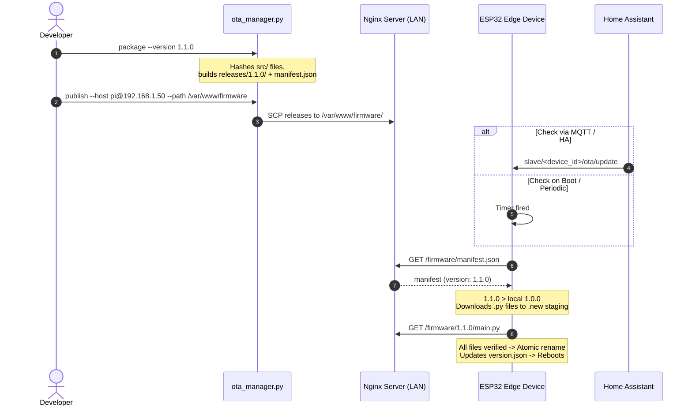

# MicroPython Universal MQTT Edge Slave (OTA & Dynamic Hardware Framework)

A flexible, production-ready MicroPython edge firmware for ESP32 devices that executes physical jobs orchestrated over MQTT.

Features:
- **Dynamic Hardware Registry**: Zero hardcoded pins. Define any combination of solenoids, servos (SwitchBot-style robotic pressers), digital inputs (status LEDs of dumb appliances, reed switches), analog inputs, and UART peripherals (AS608 optical fingerprint reader) directly in `config.json`.
- **Wi-Fi Over-The-Air (OTA) Updates**: Update remote ESP32 devices over Wi-Fi from an Nginx firmware server. Built-in release packaging and SCP publishing tool with atomic file replacement and rollback safety.
- **Home Assistant Integration**: Auto-discovers binary sensors (status LEDs), sensors (analogs), routine buttons, emergency abort controls, and OTA update triggers.

---

## 1. Dynamic Hardware Component Modeling

Devices configure their attached hardware dynamically under `components` in `config.json`. Drivers and background tasks are only started for components declared on that specific board.

### Supported Component Types

| Type | Target Hardware | Typical Configuration Parameters |
|------|-----------------|----------------------------------|
| `solenoid` | Door lock bolt, water valve | `pin`, `active_high`, `default_pulse_ms`, `max_pulse_ms` |
| `servo` | SwitchBot button presser, mechanical lever | `pin`, `min_us`, `max_us`, `max_angle` |
| `digital_in` | Dumb appliance status LED, reed switch, button | `pin`, `pull` (`"up"`/`"down"`), `invert`, `report_changes`, `ha_device_class` |
| `analog_in` | Light sensor, voltage divider, analog water level | `pin`, `report_interval_s`, `ha_device_class` |
| `digital_out` | Buzzer, indicator LED, simple relay | `pin`, `active_high`, `initial_state` |
| `as608` | Optical fingerprint reader | `uart_id`, `tx_pin`, `rx_pin`, `baudrate` |

---

### Example Profiles in `config.json`

#### Profile A: Door Controller (Solenoid + AS608 Fingerprint + Buzzer)
```json
{
  "components": {
    "door_bolt": {
      "type": "solenoid",
      "pin": 23,
      "active_high": true,
      "default_pulse_ms": 3000,
      "max_pulse_ms": 8000
    },
    "buzzer": {
      "type": "digital_out",
      "pin": 19,
      "active_high": true
    },
    "fingerprint": {
      "type": "as608",
      "uart_id": 2,
      "tx_pin": 17,
      "rx_pin": 16,
      "baudrate": 57600
    }
  },
  "routines": {
    "door_unlock": [
      {"action": "pulse", "target": "buzzer", "duration_ms": 120},
      {"action": "pulse", "target": "door_bolt", "duration_ms": 3000}
    ],
    "door_lock": [
      {"action": "digital_write", "target": "door_bolt", "state": 0}
    ]
  }
}
```

#### Profile B: Robotic SwitchBot (Coffee Machine / Wall Switch Presser)
```json
{
  "components": {
    "coffee_presser": {
      "type": "servo",
      "pin": 25,
      "min_us": 500,
      "max_us": 2500
    }
  },
  "routines": {
    "press_coffee_button": [
      {"action": "servo_set", "target": "coffee_presser", "angle": 75},
      {"action": "delay", "duration_ms": 400},
      {"action": "servo_set", "target": "coffee_presser", "angle": 0}
    ]
  }
}
```

#### Profile C: Dumb Appliance Monitor (Washing Machine / Dryer Status LED Reader)
```json
{
  "components": {
    "washer_running_led": {
      "type": "digital_in",
      "pin": 34,
      "pull": "up",
      "invert": true,
      "report_changes": true,
      "ha_device_class": "running"
    },
    "washer_done_buzzer_sense": {
      "type": "digital_in",
      "pin": 35,
      "pull": "down",
      "report_changes": true
    }
  }
}
```
*When `report_changes: true` is configured, the ESP32 automatically monitors the pin, publishes state changes to `slave/<device_id>/input/<component_id>`, and auto-discovers a `binary_sensor` in Home Assistant!*

---

## 2. Wi-Fi Over-The-Air (OTA) Update System

The firmware updates itself over Wi-Fi by fetching a `manifest.json` from your local Nginx server.



---

### Setting Up the Nginx Firmware Server

An example standalone Nginx service is included in `nginx/`:

1. Start Nginx on your server / Raspberry Pi:
   ```bash
   cd nginx
   docker compose -f docker-compose.nginx.yml up -d
   ```
   *Serves files from `./data/` on port `8080` at `http://<server-ip>:8080/firmware/`.*

---

### Packaging & Publishing Firmware Releases

1. **Package a Release**:
   ```bash
   python tools/ota_manager.py package --version 1.1.0
   ```
   This generates `releases/1.1.0/` and updates `releases/manifest.json` with SHA-256 checksums.

2. **Publish via SCP**:
   Upload the packaged release directly to your Nginx host over SSH:
   ```bash
   python tools/ota_manager.py publish \
     --host pi@192.168.1.50 \
     --path /var/www/firmware
   ```

---

## 3. Initial Board Flashing & Configuration

During initial setup, credentials and the OTA URL are saved locally into git-ignored `config.json` and flashed via USB serial:

```bash
# 1. Set Wi-Fi, MQTT, and OTA manifest URL
python tools/deploy.py set-credentials \
  --ssid "HomeWiFi" \
  --wifi-pass "SecretPassword" \
  --mqtt-host "192.168.1.100" \
  --device-id "esp32_front_door" \
  --ota-url "http://192.168.1.50:8080/firmware/manifest.json"

# 2. Flash firmware and config to ESP32
python tools/deploy.py sync --port COM3

# 3. Monitor serial output
python tools/deploy.py monitor --port COM3
```

---

## 4. Multi-Tier Testing Hierarchy

Run all unit tests in the virtual environment:
```bash
.venv\Scripts\python.exe -m pytest -v tests/
```

### Test Coverage:
1. **Dynamic Components (`tests/test_components.py`)**: Tests instantiating Door, SwitchBot, and Appliance Monitor profiles.
2. **Digital I/O (`tests/test_digital_io.py`)**: Tests debouncing, signal inversion, and input change detection.
3. **OTA Engine (`tests/test_ota.py`)**: Tests semantic version comparison, manifest fetching, atomic file replacement, and rollback guarantees.
4. **AS608 Fingerprint (`tests/test_as608.py`)**: Tests framing, checksums, search, and multi-sample enrollment.
5. **Job Runner (`tests/test_job_runner.py`)**: Tests single-job locking and emergency abort teardown.
6. **End-to-End Simulation (`tests/integration/test_door_flow.py`)**: Simulates complete finger scan $\rightarrow$ auth $\rightarrow$ door unlock flow.
7. **Live Mosquitto (`tests/integration/test_mqtt_integration.py`)**: Connects to live broker at `MQTT_BROKER_HOST`.
8. **Raspberry Pi HIL (`tests/hil/test_pi_hil.py`)**: Physical GPIO pulse timing verification on real hardware.

---

## 5. MQTT Topic Reference

| Direction | Topic | Payload Example | Purpose |
|-----------|-------|-----------------|---------|
| ESP32 $\rightarrow$ Broker | `slave/<device_id>/availability` | `online` / `offline` | LWT device availability |
| ESP32 $\rightarrow$ Broker | `slave/<device_id>/status` | `{"state":"running","job_id":"door_unlock"}` | Execution state |
| ESP32 $\rightarrow$ Broker | `slave/<device_id>/events` | `{"event":"fingerprint_scanned","finger_id":12}` | Event stream |
| ESP32 $\rightarrow$ Broker | `slave/<device_id>/input/<comp_id>` | `1` or `0` | Live input pin state |
| Broker $\rightarrow$ ESP32 | `slave/<device_id>/job/run` | `{"job":"door_unlock"}` or `{"steps":[...]}` | Run routine or ad-hoc job |
| Broker $\rightarrow$ ESP32 | `slave/<device_id>/job/abort` | `{"reason":"emergency_stop"}` | Emergency halt & failsafe reset |
| Broker $\rightarrow$ ESP32 | `slave/<device_id>/ota/check` | `{}` | Query remote OTA manifest |
| Broker $\rightarrow$ ESP32 | `slave/<device_id>/ota/update` | `{}` | Trigger OTA update & reboot |
| ESP32 $\rightarrow$ Broker | `homeassistant/<component>/<device_id>/...` | JSON Discovery Payload | Auto-discovery entities for Home Assistant |
