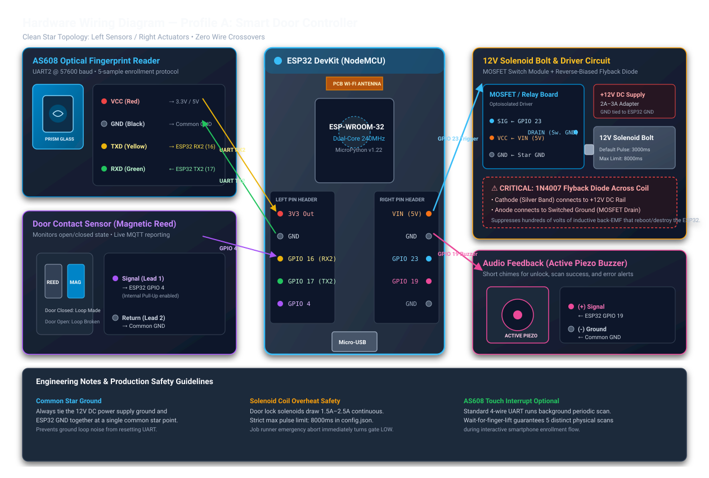

# Hardware Wiring Guide — Profile A: Smart Door Controller

This guide documents the physical hardware connections, schematic design, and electrical safety practices for deploying the **Profile A: Smart Door Controller** (ESP32 DevKit + 12V Solenoid Bolt + AS608 Optical Fingerprint Scanner + Buzzer + Magnetic Contact Sensor).

---

## 1. Electrical Wiring Schematic

The schematic uses a clean star-topology layout: low-voltage sensor and UART communications on the left header, high-power switching and audio feedback on the right header.



---

## 2. Bill of Materials (BOM)

| Component | Specification | Purpose | Notes |
|-----------|---------------|---------|-------|
| **Microcontroller** | ESP32 NodeMCU DevKit (ESP-WROOM-32) | Edge Slave Controller | 30-pin or 38-pin board |
| **Solenoid Bolt** | 12V DC Electric Drop Bolt / Cabinet Lock | Physical Door Locking Mechanism | Draws ~1.5A–2.0A surge on pull |
| **Switching Driver** | Logic-Level N-MOSFET (e.g. IRLZ44N) or Optocoupled Relay Board | Switches 12V Solenoid from 3.3V GPIO | Must be driven with 3.3V logic high |
| **Flyback Diode** | **1N4007** (1000V, 1A) or 1N5408 | Clamps inductive coil back-EMF spike | **MANDATORY** across solenoid leads |
| **Fingerprint Sensor** | AS608 Optical Fingerprint Module | Local Biometric Authentication | UART2 @ 57600 baud |
| **Audio Indicator** | 3.3V–5V Active Piezo Buzzer | Audio chimes (scan success, unlock) | Driven directly by GPIO 19 |
| **Door Sensor** | Magnetic Reed Switch (surface mount) | Detects physical open / closed door | Wire to GPIO 4 with internal pull-up |
| **12V Power Supply** | 12V DC Regulated Adapter (2A–3A) | Auxiliary power for Solenoid | Do **not** power solenoid from ESP32 |
| **5V Power Supply** | 5V 1A USB Wall Adapter or Buck Converter | Powers ESP32 logic | Share common ground with 12V rail |

---

## 3. Pin Connection Matrix

| ESP32 DevKit Pin | Component Pin | Signal Type | Description / Voltage |
|------------------|---------------|-------------|-----------------------|
| **GPIO 23** | Driver `SIG` (Gate / In) | Digital Output | Solenoid unlock trigger (Active High 3.3V) |
| **GPIO 19** | Buzzer `(+)` | Digital Output | Audio chime pulses (Active High 3.3V) |
| **GPIO 16 (RX2)**| AS608 `TXD` (Yellow wire) | UART Rx | Receives packet responses from AS608 |
| **GPIO 17 (TX2)**| AS608 `RXD` (Green wire) | UART Tx | Sends packet commands to AS608 |
| **GPIO 4** | Reed Sensor Lead 1 | Digital Input | Door open/closed monitor (Internal Pull-Up) |
| **VIN (5V)** | Driver `VCC` | Power Out | 5V logic supply for relay/driver board |
| **3V3** | AS608 `VCC` (Red wire) | Power Out | 3.3V supply (or 5V if 5V tolerant module) |
| **GND** | All Component GNDs | Ground | Common star ground point |

---

## 4. Critical Electrical Safety & Best Practices

### ⚠️ 1. Mandatory 1N4007 Flyback Diode
Solenoids are high-inductance electromagnetic coils. When GPIO 23 turns off the MOSFET, the collapsing magnetic field creates a reverse voltage spike (back-EMF) exceeding **100V to 300V**.
- **Installation**: Solder the 1N4007 diode directly across the two terminals of the solenoid.
- **Polarity**:
  - **Cathode** (marked with the silver ring/band) connects to the **+12V DC Rail**.
  - **Anode** connects to the **Switched Ground** (MOSFET Drain).
- *Failure to install this diode will cause immediate microcontroller reboots, brownout resets, or permanent ESP32 GPIO burnout.*

### ⚡ 2. Common Star Ground
- Connect the negative (GND) lead of the 12V power supply directly to the ESP32 GND pin at a **single common ground point**.
- Do not daisy-chain high-current solenoid ground returns through breadboard power rails. This avoids ground bounces that disrupt high-speed UART communication with the AS608 scanner.

### 🔥 3. Coil Duty Cycle & Thermal Protection
Continuous duty door solenoids will overheat if left energized for more than 10–15 seconds.
- In `config.json`, the solenoid driver enforces a strict `max_pulse_ms: 8000` limit.
- The standard routine uses `duration_ms: 3000` (3 seconds), which allows ample time for the door to be pushed open before the bolt springs back.
- If an emergency stop occurs, the job runner immediately turns off all pins via failsafe zero.

---

## 5. Software Profile Mapping (`config.json`)

The physical pins above correspond directly to the profile defined in `config.json`:

```json
{
  "components": {
    "door_bolt": {
      "type": "solenoid",
      "pin": 23,
      "active_high": true,
      "default_pulse_ms": 3000,
      "max_pulse_ms": 8000
    },
    "buzzer": {
      "type": "digital_out",
      "pin": 19,
      "active_high": true
    },
    "fingerprint": {
      "type": "as608",
      "uart_id": 2,
      "tx_pin": 17,
      "rx_pin": 16,
      "baudrate": 57600
    },
    "door_contact": {
      "type": "digital_in",
      "pin": 4,
      "pull": "up",
      "invert": false,
      "report_changes": true,
      "ha_device_class": "door"
    }
  },
  "routines": {
    "door_unlock": [
      {"action": "pulse", "target": "buzzer", "duration_ms": 120},
      {"action": "pulse", "target": "door_bolt", "duration_ms": 3000}
    ]
  }
}
```

---

## 6. Bench Testing & Verification

1. **Simulate on Desktop**:
   Run the native simulator to test MQTT dispatching before touching physical wires:
   ```bash
   python tools/simulator.py
   ```

2. **Trigger Unlock via MQTT**:
   Publish to the job run topic on your Mosquitto broker:
   ```bash
   mosquitto_pub -h localhost -t "slave/esp32_front_door/job/run" -m '{"job":"door_unlock"}'
   ```
   *Expected behavior*: Buzzer sounds a 120ms beep, followed by the solenoid pulling open for exactly 3000ms.

3. **Verify Reed Sensor State**:
   Open and close the door contact while monitoring MQTT events:
   ```bash
   mosquitto_sub -h localhost -t "slave/esp32_front_door/input/#" -v
   ```
   *Expected behavior*: Outputs `slave/esp32_front_door/input/door_contact 1` when closed and `0` when opened.

---

## 7. Raspberry Pi Hardware-in-the-Loop (HIL) Test Wiring

For comprehensive automated physical verification (`tests/hil/test_pi_hil.py`), wire a Raspberry Pi 4/5 to the ESP32 DUT:


### HIL Multi-Signal Pinout Matrix:

| Signal Function | ESP32 DUT Pin | Raspberry Pi Pin | Direction | HIL Environment Variable |
|-----------------|---------------|------------------|-----------|--------------------------|
| **Common Ground** | GND | Physical Pin 06 / 09 (GND) | Shared | — |
| **Solenoid Pulse Sense** | GPIO 23 (Out) | Physical Pin 11 (BCM 17) | ESP32 $\rightarrow$ Pi | `PI_SOLENOID_PIN=17` |
| **PWM Servo Sense** | GPIO 25 (PWM Out)| Physical Pin 16 (BCM 23) | ESP32 $\rightarrow$ Pi | `PI_PWM_PIN=23` |
| **Digital Output Sense**| GPIO 19 (Out) | Physical Pin 13 (BCM 27) | ESP32 $\rightarrow$ Pi | `PI_DIGITAL_OUT_PIN=27` |
| **Input Stimulus** | GPIO 4 (In) | Physical Pin 15 (BCM 22) | Pi $\rightarrow$ ESP32 | `PI_INPUT_STIMULUS_PIN=22` |
| **UART Peripheral Tx** | GPIO 16 (RX2 In) | Physical Pin 08 (BCM 14 TXD) | Pi $\rightarrow$ ESP32 | `PI_UART_PORT=/dev/serial0` |
| **UART Peripheral Rx** | GPIO 17 (TX2 Out)| Physical Pin 10 (BCM 15 RXD) | ESP32 $\rightarrow$ Pi | `PI_UART_PORT=/dev/serial0` |

> [!WARNING]
> **Voltage Level Safety**: Raspberry Pi GPIOs are strictly **3.3V CMOS**. Never connect the high-voltage +12V solenoid coil rail directly to the Raspberry Pi pin. Probe the ESP32's 3.3V logic output lines directly, or use an optocoupler (e.g. PC817) if measuring high-side loads.

### Running the Complete HIL Test Suite:
```bash
# On the Raspberry Pi wired to the ESP32 DUT:
export MQTT_BROKER="127.0.0.1"
export DEVICE_ID="esp32_hil_dut"
export PI_SOLENOID_PIN=17
export PI_PWM_PIN=23
export PI_DIGITAL_OUT_PIN=27
export PI_INPUT_STIMULUS_PIN=22
export PI_UART_PORT="/dev/serial0"

pytest -v tests/hil/test_pi_hil.py
```

### Automated Assertions:
1. `test_measure_solenoid_physical_pulse_width`: Asserts that a 1000ms pulse stays within `1000ms ± 150ms` and safely returns to `0`.
2. `test_measure_servo_pwm_duty_and_frequency`: Asserts carrier frequency is `50Hz ± 5Hz` and pulse widths accurately match requested angles (nominal `500µs` for 0° and `1500µs` for 90°).
3. `test_digital_output_state_switching`: Verifies physical logic level switching for discrete outputs (1 = ON, 0 = OFF).
4. `test_digital_input_stimulus_and_mqtt_reporting`: Drives physical level transitions into the ESP32 and verifies live MQTT change telemetry on `slave/<id>/input/<comp>`.
5. `test_uart_as608_peripheral_emulation`: Intercepts AS608 command packets over UART, returns mock fingerprint ACKs, and verifies the end-to-end MQTT event pipeline.


