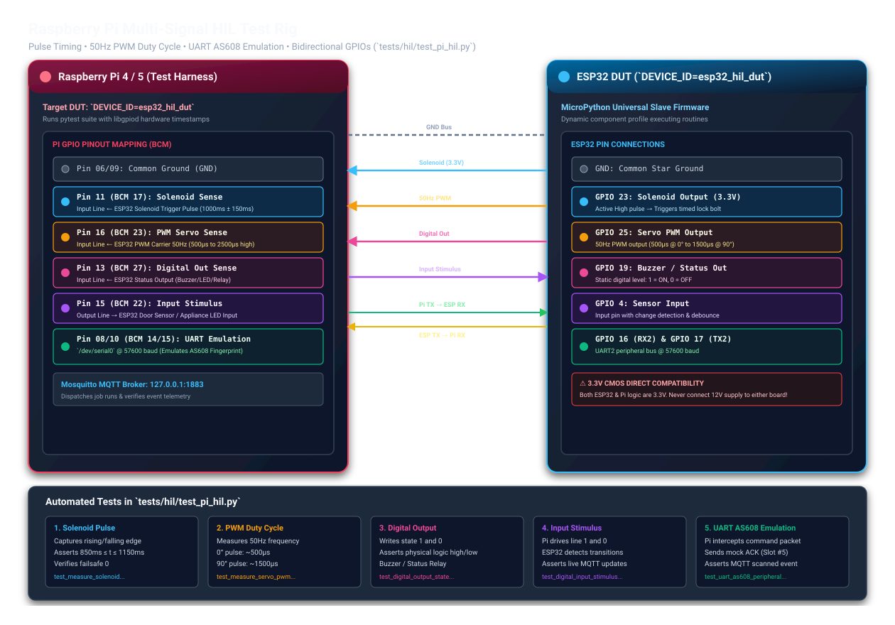

# Raspberry Pi Hardware-in-the-Loop (HIL) Setup & Provisioning Guide

This guide describes how to prepare, flash, automatically provision, wire, and execute tests on a dedicated **Raspberry Pi 4 / 5 Hardware-in-the-Loop (HIL) test rig** connected to the ESP32 Device Under Test (DUT).

---

## Architecture & Hardware Wiring

The Raspberry Pi automates physical electrical verification (solenoid pulse timing, 50Hz PWM carrier & duty cycle, discrete output levels, input sensor stimulus, and AS608 optical fingerprint UART emulation).



---

## Step 1: Flashing the SD Card (Headless First-Boot)

To prepare a fresh Raspberry Pi without connecting a monitor or keyboard:

1. Download and launch **[Raspberry Pi Imager](https://www.raspberrypi.com/software/)**.
2. **Operating System**: Choose **Raspberry Pi OS Lite (64-bit)** *(Bookworm — headless, lightweight)*.
3. **Storage**: Select your target microSD card.
4. **Pre-configure OS Customisation Settings** (click the gear icon or choose "Edit Settings"):
   - **Hostname**: `pi-hil` (will be accessible as `pi-hil.local`).
   - **Set username and password**: e.g., Username: `pi`, Password: your chosen password.
   - **Configure wireless LAN**: Enter your Wi-Fi SSID, password, and country code.
   - **Services tab**: Check **Enable SSH** and select **Use password authentication** (the setup script will convert this to keyed-SSH automatically).
5. Click **Save** and **Write**.
6. When complete, insert the microSD card into the Raspberry Pi and power it on. It will automatically join your Wi-Fi network and start SSH.

---

## Step 2: One-Command Automated Provisioning

Once the Raspberry Pi has booted and joined your Wi-Fi network (and you know its IP address, e.g. `192.168.1.50` or `pi-hil.local`), run the automated provisioning script from your computer:

```bash
python tools/hil_manager.py setup --host 192.168.1.50 --user pi
```

### What `setup` automatically performs:
1. **Network Connectivity**: Verifies port 22 is open and reachable.
2. **Keyed SSH Authentication**:
   - Locates or generates a secure ED25519 SSH keypair (`~/.ssh/id_ed25519`).
   - Copies the public key to the Pi via `ssh-copy-id` (you will be prompted for the Pi user's password **once**).
   - Validates that passwordless keyed SSH is active.
3. **Saves Configuration**:
   - Writes connection settings to `.hil_config.json` and `.env` (`HIL_PI_HOST`, `HIL_PI_USER`, `HIL_PI_KEY`, `HIL_DEVICE_ID`).
4. **Remote System Package Installation**:
   - Runs `sudo apt update && sudo apt install -y git python3-pip virtualenv python3-gpiod gpiod mosquitto mosquitto-clients`.
5. **Mosquitto Configuration**:
   - Generates `/etc/mosquitto/conf.d/lan.conf` (`listener 1883`, `allow_anonymous true`) so the ESP32 can publish to it over Wi-Fi, and restarts the broker.
6. **Hardware UART Enablement**:
   - Disables the serial login console and enables the hardware serial port on `/dev/serial0` (for AS608 fingerprint emulation).
7. **Workspace & Virtualenv**:
   - Creates `~/mqtt_micropy_slave/` on the Pi.
   - Builds a Python virtualenv with `--system-site-packages` (inheriting hardware `gpiod`).
   - Syncs project files and installs `requirements.txt`.

> [!NOTE]
> If hardware UART was just enabled for the first time, reboot the Pi once:
> ```bash
> python tools/hil_manager.py reboot
> ```

---

## Step 3: Physical Wiring Matrix

Connect female-to-female jumper wires between the Raspberry Pi 40-pin header and the ESP32:

| Signal Function | Raspberry Pi Pin | ESP32 DUT Pin | Direction | HIL Environment Variable |
|---|---|---|---|---|
| **Common Ground** | **Pin 06 or 09 (GND)** | **GND** | Shared | — *(Mandatory reference!)* |
| **Solenoid Pulse Sense** | **Pin 11 (BCM 17)** | **GPIO 23** | ESP32 $\rightarrow$ Pi | `PI_SOLENOID_PIN=17` |
| **PWM Servo Sense** | **Pin 16 (BCM 23)** | **GPIO 25** | ESP32 $\rightarrow$ Pi | `PI_PWM_PIN=23` |
| **Digital Output Sense** | **Pin 13 (BCM 27)** | **GPIO 19** | ESP32 $\rightarrow$ Pi | `PI_DIGITAL_OUT_PIN=27` |
| **Input Stimulus** | **Pin 15 (BCM 22)** | **GPIO 4** | Pi $\rightarrow$ ESP32 | `PI_INPUT_STIMULUS_PIN=22` |
| **UART Tx (Pi $\rightarrow$ ESP)** | **Pin 08 (BCM 14 TXD)**| **GPIO 16 (RX2)** | Pi $\rightarrow$ ESP32 | `PI_UART_PORT=/dev/serial0` |
| **UART Rx (ESP $\rightarrow$ Pi)** | **Pin 10 (BCM 15 RXD)**| **GPIO 17 (TX2)** | ESP32 $\rightarrow$ Pi | `PI_UART_PORT=/dev/serial0` |

> [!WARNING]
> **Voltage Level Safety**: Raspberry Pi GPIO pins are strictly **3.3V CMOS**. Never connect a +12V solenoid coil rail directly to a Pi pin. Always probe the ESP32's 3.3V logic outputs, or use an optocoupler (e.g. PC817).

---

## Step 4: Running HIL Tests Remotely

Once configured, you do not need to log into the Pi manually to test.

### Option A: Using the HIL Manager CLI
Synchronizes your latest local code changes and executes the test suite remotely over SSH:

```bash
# Run all HIL tests
python tools/hil_manager.py run

# Run a specific test
python tools/hil_manager.py run -k pwm
```

### Option B: Using Pytest
Running pytest automatically checks if the Raspberry Pi is online.
- If the Pi is **online**: it syncs and runs the remote HIL tests.
- If the Pi is **offline** or unconfigured: it cleanly skips the physical tests without failing your local unit test run.

```bash
pytest -v tests/hil/test_pi_hil.py
```

---

## Step 5: Management Commands

Check rig health, sync files, or reboot the Pi anytime:

```bash
# Check connectivity, SSH key status, Mosquitto service, and UART availability
python tools/hil_manager.py status

# Push latest local edits to the Pi without running tests
python tools/hil_manager.py sync

# Reboot the remote Pi
python tools/hil_manager.py reboot
```
